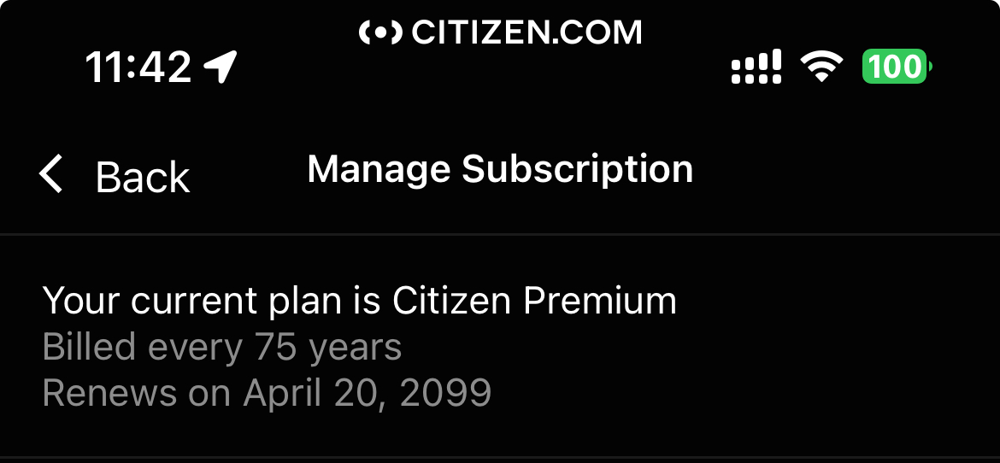

# CitizenPremium

Tweak that enable [Citizen](https://apps.apple.com/us/app/citizen-local-safety-alerts/id1039889567) Premium features (including notifications).

## History

I found out how to interact with Citizen app

So here's the free tweak

Latest build tested on : iOS 26.1, Citizen 0.1267.0

## How to install?

- You can use [Sideloadly](https://sideloadly.io) to inject this tweak into an IPA file.

- You can install it on a jailbroken device.

- Or you can use your favorite signing service.

## To be fixed

~~- 'Ultra 911' tab crashing.~~

~~- Bug with 'transcription' feature for radio ("Unlock with Plus" prompted sometimes).~~

## Contributions

Thanks to [asdfzxcvbn](https://github.com/asdfzxcvbn) for helping me on making this tweak.

Follow me on Twitter for more content! [@vincedes3](https://x.com/vincedes3)
